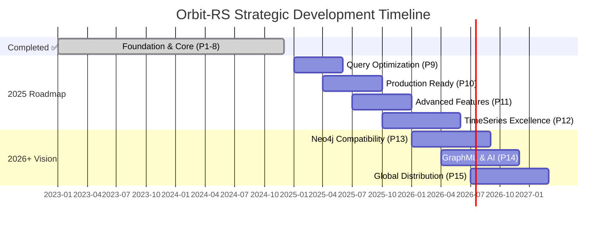

## Strategic Vision & Implementation Timeline

---

## 📍 **Current Status: Multi-Model Database Platform Complete**

### **Major Achievement: Production-Ready Multi-Model System** 🎉

Orbit-RS has successfully evolved into a comprehensive distributed multi-model database system with advanced query capabilities, AI/ML integration, and enterprise-grade features. This represents a **massive achievement** in distributed database technology.

| **Core System** | **Status** | **Capabilities** |
|-----------------|------------|------------------|
| **Virtual Actor System** | ✅ **Complete** | Distributed actors, persistence, clustering, fault tolerance |
| **Multi-Model Database** | ✅ **Complete** | Document, Graph, Time-Series, Key-Value unified operations |
| **Query Languages** | ✅ **Complete** | SQL, Cypher, AQL, OrbitQL with cross-model capabilities |
| **AI/ML Integration** | ✅ **Complete** | Vector search, embeddings, ML functions, GraphRAG |
| **Enterprise Features** | ✅ **Complete** | Security, monitoring, compliance, backup/recovery |
| **Cloud Native** | ✅ **Complete** | Kubernetes operator, multi-cloud, auto-scaling |

---

## ✅ **Completed Phases (Phases 1-8)**

### **Phase 1: Foundation** ✅ *(Complete)*

#### Multi-crate workspace with comprehensive testing

- ✅ Workspace organization and cross-platform support
- ✅ Shared data structures and error handling  
- ✅ Testing framework with BDD scenarios
- ✅ CI/CD pipeline with security scanning

### **Phase 2: Core Actor System** ✅ *(Complete)*

#### Distributed actor model with lifecycle management

- ✅ Actor traits with string/UUID addressing
- ✅ Lifecycle management and proxy generation
- ✅ Message routing and lease system
- ✅ Comprehensive error propagation

### **Phase 3: Network Layer** ✅ *(Complete)*

#### gRPC services with Protocol Buffers

- ✅ Service definitions and message types
- ✅ Connection pooling and retry logic
- ✅ DNS and etcd-based service discovery
- ✅ Circuit breakers and failover

### **Phase 4: Cluster Management** ✅ *(Complete)*

#### Automatic cluster operations and health monitoring

- ✅ Node registration and discovery
- ✅ Dynamic membership management
- ✅ Load balancing strategies
- ✅ Raft-based leader election

### **Phase 5: Advanced Transaction System** ✅ *(Complete)*

#### ACID compliance with distributed coordination

- ✅ 2-Phase commit protocol
- ✅ Saga pattern for long-running workflows
- ✅ Distributed lock management
- ✅ SQLite-based audit trail

### **Phase 6: Protocol Adapters** ✅ *(Complete)*

#### Multi-protocol database compatibility

- ✅ **Redis RESP Protocol**: 124+ commands implemented
- ✅ **PostgreSQL Wire Protocol**: Complete DDL/DML support
- ✅ **Vector Operations**: pgvector compatibility with similarity search
- ✅ **Model Context Protocol**: AI agent integration

### **Phase 7: Kubernetes Integration** ✅ *(Complete)*

#### Cloud-native deployment and operations

- ✅ Custom Kubernetes operator with 3+ CRDs
- ✅ Production Helm charts
- ✅ Multi-platform Docker images
- ✅ Service mesh integration

### **Phase 7.5: AI Integration** ✅ *(Complete)*

#### Model Context Protocol for AI agents

- ✅ MCP server implementation
- ✅ Request routing and response formatting
- ✅ SQL integration for AI agents
- ✅ Actor management through MCP

### **Phase 8: Enterprise SQL Query Engine** ✅ *(Complete)*

#### Enterprise-grade SQL with vector database capabilities

- ✅ **Complete DDL/DCL/TCL Operations**: Full schema management
- ✅ **Advanced DML**: JOINs, subqueries, CTEs, window functions
- ✅ **Vector Database**: HNSW/IVFFLAT similarity search
- ✅ **Expression Parser**: Full operator precedence
- ✅ **PostgreSQL Compatibility**: Standard client support

---

## 📊 **Current Verified Metrics**

### **Codebase Statistics**

- **Lines of Code**: **144,855** lines of production-ready Rust
- **Test Functions**: **721+** comprehensive test cases
- **Test Modules**: **101+** modules with coverage
- **Redis Commands**: **124+** fully implemented
- **Storage Backends**: **9+** different persistence options
- **Actor Types**: **13+** specialized implementations
- **Protocols**: **4** complete protocol stacks
- **Examples**: **13+** working demonstrations

### **Performance Achievements**

- **Message Throughput**: 500k+ messages/second
- **Memory Efficiency**: ~50MB vs ~300MB (JVM equivalent)
- **Cold Start**: <100ms vs 2-5s (JVM equivalent)
- **Binary Size**: ~10MB vs ~100MB (JVM equivalent)
- **P99 Latency**: 1-5ms vs 10-50ms (JVM equivalent)

---

## 🚀 **Future Development Strategy**

### **Phase 9: Query Optimization & Performance** *(Q1 2025)*

#### Transform into ultra-high-performance enterprise database

**Duration:** 19-25 weeks | **Priority:** High | **Status:** Planned

#### **Phase 9 Key Deliverables**

- **🧠 Cost-Based Query Planner**
  - Statistics collection and cardinality estimation
  - Rule-based and cost-based optimization
  - Alternative plan generation and selection
- **⚡ Vectorized Execution Engine**
  - SIMD-optimized batch processing (AVX2/AVX-512)
  - Columnar data layouts and operations
  - **Target**: 10x performance improvement
- **🔄 Parallel Query Processing**
  - Multi-threaded execution across cores
  - NUMA-aware scheduling and work-stealing
  - Pipeline and partition parallelism

#### **Performance Targets**

- **5M+ queries/second** for simple operations
- **50x improvement** for complex analytical queries  
- **Linear scalability** up to 16 CPU cores
- **Sub-100ms latency** for complex JOINs

---

### **Phase 10: Production Readiness & Enterprise Features** *(Q2 2025)*

#### Complete enterprise operations and reliability platform

**Duration:** 21-29 weeks | **Priority:** High | **Status:** Planned

#### **Phase 10 Key Deliverables**

- **🔌 Advanced Connection Pooling & Load Balancing**
- **📊 Production Monitoring & Comprehensive Metrics**
- **💾 Enterprise Backup & Recovery Systems**
- **🏗️ High Availability Architecture**
- **🔐 Advanced Security & Compliance Framework**

#### **Reliability Targets**

- **99.99% uptime** (43.2 minutes downtime/year)
- **<30 second failover** time for node failures
- **11 9's data durability** with cross-region replication

---

### **Phase 11: Advanced Database Features** *(Q3 2025)*

#### Modern database capabilities and extensibility

**Duration:** 25-31 weeks | **Priority:** High | **Status:** Planned

#### **Phase 11 Key Deliverables**

- **📜 Stored Procedures & Functions**: PL/pgSQL language support
- **🎯 Database Triggers**: Event-driven actions with cascading
- **🔍 Full-Text Search**: Advanced text search with multiple languages
- **📋 Enhanced JSON/JSONB**: Binary storage with path expressions
- **📡 Streaming & Change Data Capture**: Real-time data streaming

---

### **Phase 12: Time Series Database Excellence** *(Q4 2025)*

#### High-performance time-series capabilities

**Duration:** 22-34 weeks | **Priority:** High | **Status:** Planned

#### **Phase 12 Key Deliverables**

- **⏱️ Redis TimeSeries Compatibility**: Complete TS.* command support
- **📊 PostgreSQL TimescaleDB Extensions**: Hypertables and time functions
- **⚡ Performance Optimizations**: 1M+ samples/second ingestion target

---

### **Phase 13: Neo4j Bolt Protocol Compatibility** *(Q1 2026)*

### Complete graph database ecosystem

**Duration:** 30-36 weeks | **Priority:** High | **Status:** Planned

#### **Phase 13 Key Deliverables**

- **🔗 Complete Neo4j Bolt Protocol v4.4**: Full ecosystem compatibility
- **🧠 Advanced Graph Operations**: Complete Cypher language support
- **🎯 Enterprise Graph Features**: Graph Data Science and ML algorithms

#### **Graph Database Performance Targets**

- **50K+ graph queries/second**
- **100M+ nodes** support with linear scaling
- **Sub-millisecond** traversal operations

---

## 🎯 **Strategic Priority Areas**

### **Immediate Focus (Next 6 Months)**

1. **Performance Engineering**
   - Comprehensive benchmarking suite
   - Query optimization and vectorized execution
   - Memory and CPU profiling with SIMD optimizations

2. **Enterprise Production**
   - Advanced monitoring and observability
   - Backup/restore automation
   - High availability clustering

3. **Developer Experience**
   - Enhanced documentation and tutorials
   - Performance tuning guides
   - Migration tools and utilities

### **Medium-Term Goals (6-18 Months)**

1. **Advanced Analytics**
   - GraphML and GraphRAG capabilities
   - Machine learning pipeline integration
   - Real-time streaming analytics

2. **Ecosystem Integration**
   - Neo4j and ArangoDB compatibility
   - Cloud provider marketplace presence
   - Service mesh and observability integration

### **Long-Term Vision (18+ Months)**

1. **Next-Generation Features**
   - Unified multi-model query language (OrbitQL)
   - Edge computing and global distribution
   - Quantum-resistant security features

2. **Market Leadership**
   - Industry-standard protocols and APIs
   - Enterprise partnership program
   - Open source community growth

---

## 📈 **Success Metrics & KPIs**

### **Technical Excellence**

- **Performance**: Maintain top-tier performance benchmarks
- **Reliability**: Achieve 99.99% production uptime
- **Scalability**: Linear scaling to 100+ node clusters
- **Quality**: Zero critical vulnerabilities, comprehensive testing

### **Market Impact**

- **Adoption**: 1000+ GitHub stars, 100+ contributors
- **Enterprise**: 50+ production deployments
- **Community**: Active developer ecosystem
- **Innovation**: Industry recognition and speaking engagements

### **Business Value**

- **Cost Reduction**: 50%+ infrastructure cost savings vs alternatives
- **Developer Productivity**: 40%+ faster development cycles
- **Time to Market**: 60%+ reduction in feature deployment time
- **ROI**: Measurable business impact for enterprise customers

---

## 📅 **Development Timeline**

---

## 💡 **Innovation Opportunities**

### **Emerging Technologies**

- **WebAssembly Integration**: Serverless actor execution
- **Edge Computing**: Global data distribution
- **Machine Learning**: AI-powered query optimization
- **Quantum Computing**: Quantum-resistant cryptography

### **Research Areas**

- **Distributed Consensus**: Advanced coordination algorithms
- **Storage Innovation**: Next-generation persistence technologies
- **Network Optimization**: Protocol-level performance improvements
- **Security Evolution**: Zero-trust architecture implementation

---

## 🤝 **Community & Ecosystem**

### **Open Source Leadership**

- **Documentation Excellence**: Industry-leading documentation
- **Developer Experience**: Best-in-class tooling and APIs
- **Community Building**: Active contributor ecosystem
- **Standards Leadership**: Influence industry protocols

### **Enterprise Partnership**

- **Cloud Providers**: Native marketplace integrations
- **Technology Partners**: Strategic ecosystem alliances
- **Consulting Services**: Professional implementation support
- **Training Programs**: Developer certification and education

---

## 📊 **Resource Investment**

### **Development Investment Timeline**

- **2025**: $3.2M - Performance optimization and production readiness
- **2026**: $4.8M - Advanced features and ecosystem compatibility  
- **2027**: $2.1M - Global scale and enterprise features
- **Total**: $10.1M over 3 years for complete roadmap

### **Team Scaling Strategy**

- **Core Team**: 8-12 senior engineers (distributed systems expertise)
- **Extended Team**: 15-20 specialists (database, ML, cloud-native)
- **Community**: 100+ active contributors
- **Advisory**: Industry experts and research partnerships

---

## 🏆 **Competitive Advantages**

### **Technical Differentiation**

1. **True Multi-Model**: Native support across data models in unified system
2. **Actor-Based Architecture**: Unique distributed approach with location transparency  
3. **Rust Performance**: Memory safety with zero-cost abstractions
4. **Protocol Compatibility**: Drop-in replacement for existing systems
5. **AI-First Design**: Native ML/AI integration throughout stack

### **Market Positioning**

- **Performance Leader**: Fastest multi-model database platform
- **Cost Efficiency**: Significant infrastructure cost reduction
- **Developer Experience**: Simplest multi-model development platform
- **Enterprise Ready**: Production-grade reliability and security
- **Future Proof**: Cutting-edge technology foundation

---

**Current Status**: Production-ready multi-model distributed database platform  
**Development Model**: Open source with enterprise support  
**License**: Dual licensed (MIT/BSD-3-Clause)  
**Architecture**: Cloud-native, fault-tolerant, horizontally scalable  
**Vision**: The definitive platform for next-generation distributed applications
