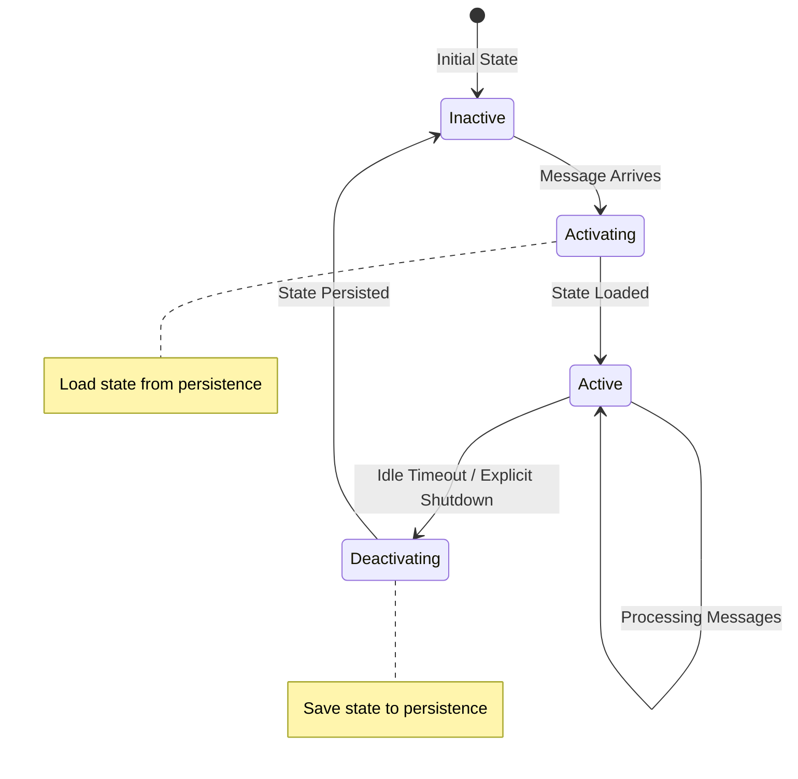

## Overview

Orbit-RS implements a sophisticated virtual actor system where actors can be transparently activated on-demand when messages arrive, with their state automatically persisted and restored across the distributed cluster. This document explains the architecture, mechanisms, and implementation details of how virtual actors maintain state persistence and handle activation/deactivation cycles.

### 🔍 **Quick Answer: Storage Backend Independence**

**Yes, cloud storage (S3, Azure, GCP, MinIO) and local storage (LSM-Tree, RocksDB, B-Tree) implementations are completely independent:**

- ✅ **Cloud providers** directly use REST APIs to store data as objects/blobs
- ✅ **Local providers** implement complete storage engines with their own file formats  
- ✅ **No layering** - you choose ONE backend type, not a combination
- ✅ **Each is self-contained** - handles all persistence operations independently

See the [Storage Backend Independence](#%EF%B8%8F-important-storage-backend-independence) section for detailed technical explanation.

## Core Concepts

### Virtual Actors

Virtual actors in Orbit-RS are objects that:
- Interact with the world using asynchronous messages
- Can be **active** (in-memory and processing messages) or **inactive** (state persisted to storage)
- Are automatically activated on any available server when messages arrive
- Have their state transparently managed by the framework

### Actor Lifecycle States



## Architecture Components

### 1. Actor Leases

Actor leases are the foundation of distributed coordination in Orbit-RS. They prevent multiple nodes from activating the same actor simultaneously.

```rust

#[derive(Debug, Clone, Serialize, Deserialize, PartialEq)]
pub struct ActorLease {
    pub key: ActorKey,           // Actor identifier
    pub node_id: String,         // Owning node
    pub expires_at: SystemTime,  // Lease expiration
    pub lease_duration: Duration,
    pub version: u64,            // For optimistic concurrency
    pub metadata: LeaseMetadata,
}

#[derive(Debug, Clone, Hash, PartialEq, Eq)]
pub struct ActorKey {
    pub actor_id: Uuid,
    pub actor_type: String,
}
```

**Key Features:**
- **Distributed Ownership**: Only one node can hold a lease for an actor at a time
- **Automatic Expiration**: Leases expire if not renewed, preventing deadlocks
- **Version Control**: Optimistic concurrency control prevents conflicts
- **Metadata Tracking**: Creation time, renewal count, and custom data

### 2. Actor Snapshots

Actor snapshots contain the serialized state of virtual actors with integrity checking and versioning.

```rust

#[derive(Debug, Clone, Serialize, Deserialize)]
pub struct ActorSnapshot {
    pub actor_reference: AddressableReference,
    pub snapshot_id: String,      // Unique snapshot identifier
    pub version: u64,             // State version number
    pub state_data: serde_json::Value, // Serialized actor state
    pub created_at: i64,          // Creation timestamp
    pub updated_at: i64,          // Last update timestamp
    pub state_hash: String,       // SHA-256 integrity hash
    pub tags: HashMap<String, String>,
    pub ttl_seconds: Option<u64>, // Automatic cleanup
}
```

**Key Features:**
- **Integrity Checking**: SHA-256 hashes ensure data consistency
- **Version Control**: Optimistic concurrency with version numbers
- **Automatic Cleanup**: TTL-based expiration for old snapshots
- **Metadata Tags**: Custom categorization and search capabilities

## Persistence Backends

Orbit-RS supports multiple configurable storage backends that fall into two main categories:

### **Local Storage Backends** (Self-Contained)
These providers implement complete storage engines locally:

### 1. Copy-on-Write B+ Tree (`CowBTreeProvider`)

**Optimized for**: OLTP workloads with frequent reads and moderate writes

**Features:**
- Write-ahead logging (WAL) for durability
- Memory-efficient copy-on-write operations
- Fast point lookups and range queries
- Automatic background snapshots

```toml
[persistence]
type = "cow_btree"
data_dir = "./orbit_data"
max_keys_per_node = 256
wal_buffer_size = 1048576
enable_compression = true
wal_sync_interval = 5
```

### 2. LSM-Tree (`LsmTreeProvider`)

**Optimized for**: Write-heavy workloads with high throughput requirements

**Features:**
- Log-structured merge tree with background compaction
- Bloom filters for efficient negative lookups
- Immutable memtables for consistent reads
- Configurable compaction strategies

```toml
[persistence]
type = "lsm_tree"
data_dir = "./orbit_lsm_data"
memtable_size_limit = 67108864  # 64MB
max_memtables = 10
bloom_filter_fp_rate = 0.01
enable_compaction = true
compaction_threshold = 4
```

### 3. RocksDB (`RocksDBProvider`)

**Optimized for**: Production workloads requiring ACID transactions

**Features:**
- Production-ready embedded database
- ACID transaction support with 2-phase commit
- Column families for data organization
- Built-in compression and backup

```toml
[persistence]
type = "rocksdb"
data_dir = "./orbit_rocksdb"
create_if_missing = true
enable_statistics = true
compression_type = "snappy"
block_cache_size = 268435456  # 256MB
```

### **Cloud Storage Backends** (Object Storage)
These providers use external cloud services and are **independent** of the local storage implementations:

### 4. Cloud Storage (S3, Azure, GCP)

**Optimized for**: Distributed deployments with high durability requirements

**Features:**
- Object storage for massive scale
- Built-in redundancy and availability
- Cross-region replication
- Server-side encryption

```toml
[persistence.s3]
type = "s3"
endpoint = "https://s3.amazonaws.com"
region = "us-west-2"
bucket = "orbit-actor-state"
access_key_id = "${AWS_ACCESS_KEY_ID}"
secret_access_key = "${AWS_SECRET_ACCESS_KEY}"
prefix = "orbit"
enable_ssl = true
```

### 5. In-Memory (`MemoryProvider`)

**Optimized for**: Development, testing, and high-performance scenarios

**Features:**
- Ultra-fast concurrent data structures (DashMap)
- Optional disk backup with compression
- Memory usage monitoring and limits
- Perfect for stateless or ephemeral workloads

```toml
[persistence.memory]
type = "memory"
max_entries = 100000
enable_disk_backup = true
backup_path = "/data/orbit-backup.json"
sync_interval = 300
compression = "gzip"
```

## ⚠️ **Important: Storage Backend Independence**

The **cloud storage backends (S3, Azure, GCP, MinIO)** are **completely independent** from the **local storage implementations (LSM-Tree, RocksDB, B-Tree)**:

### **Cloud Providers Are Self-Contained**
- **Direct Object Storage**: Cloud providers directly store actor leases and snapshots as objects/blobs
- **No Local Storage Layer**: They don't use LSM-Tree, RocksDB, or B-Tree underneath
- **REST API Based**: Use HTTP REST APIs to interact with cloud services
- **Simple Key-Value**: Store serialized actor data as JSON objects with metadata

### **Local Providers Are Self-Contained** 
- **Complete Storage Engines**: Each implements its own data structures and persistence
- **Disk-Based**: Store data in local files using their own formats
- **No Cloud Dependency**: Operate entirely on local storage devices

### **Example Configurations**

**Option 1: Pure Cloud Storage (S3)**
```toml

# Uses S3 directly - no local storage involved
[server]
persistence_backend = "s3"

[persistence.s3]
type = "s3"
endpoint = "https://s3.amazonaws.com"
bucket = "orbit-actor-state"

# Actor leases stored as: s3://bucket/orbit/leases/ActorType/actor-id
```

**Option 2: Pure Local Storage (LSM-Tree)**
```toml

# Uses LSM-Tree directly - no cloud storage involved
[server]
persistence_backend = "lsm_tree"

[persistence.lsm_tree]
type = "lsm_tree"
data_dir = "/ssd/orbit_data"

# Actor leases stored in local LSM-Tree files
```

**You cannot combine them** - each backend is a complete, standalone persistence solution.

### **Architecture Diagram**

```
┌─────────────────────────────────────────────────────────────┐
│                    Orbit-RS Framework                      │
├─────────────────────────────────────────────────────────────┤
│              AddressableDirectoryProvider                  │
│                ClusterNodeProvider                         │
├─────────────┬─────────────┬─────────────┬─────────────────┤
│             │             │             │                 │
│   Cloud     │   Local     │   Local     │     Local       │
│  Storage    │  Storage    │  Storage    │    Storage      │
│             │             │             │                 │
│ ┌─────────┐ │ ┌─────────┐ │ ┌─────────┐ │  ┌─────────────┐│
│ │   S3    │ │ │LSM-Tree │ │ │RocksDB  │ │  │ B+Tree+WAL ││
│ │Provider │ │ │Provider │ │ │Provider │ │  │ Provider    ││
│ │         │ │ │         │ │ │         │ │  │             ││
│ │REST API │ │ │SSTables │ │ │ColumnF │ │  │ COW Nodes   ││
│ │Objects  │ │ │Memtable │ │ │ WAL     │ │  │ WAL         ││
│ └─────────┘ │ └─────────┘ │ └─────────┘ │  └─────────────┘│
│      │      │      │      │      │      │        │        │
│      │      │      │      │      │      │        │        │
│   AWS S3    │ Local SSD   │ Local SSD   │   Local SSD    │
│   Storage   │   Files     │   Files     │     Files      │
└──────┼──────┴──────┼──────┴──────┼──────┴────────┼────────┘
       │             │             │               │
    Internet      Disk I/O      Disk I/O       Disk I/O
```

### **Code Implementation Evidence**

Looking at the actual implementation in `cloud.rs` vs local storage:

**S3 Provider** (Direct REST API):
```rust
// S3 stores data directly as HTTP objects
impl S3AddressableDirectoryProvider {
    async fn put_object(&self, key: &str, data: &[u8]) -> OrbitResult<()> {
        let url = format!("{}/{}/{}", self.config.endpoint, self.config.bucket, key);
        let response = self.client.put(&url).body(data.to_vec()).send().await?;
        // Direct HTTP PUT to S3 - no local storage involved
    }
    
    async fn get_object(&self, key: &str) -> OrbitResult<Option<Vec<u8>>> {
        let url = format!("{}/{}/{}", self.config.endpoint, self.config.bucket, key);
        let response = self.client.get(&url).send().await?;
        // Direct HTTP GET from S3 - no local storage involved
    }
}
```

**LSM-Tree Provider** (Local Data Structures):
```rust
// LSM-Tree manages its own memtables, SSTables, and compaction
impl LsmTreeAddressableProvider {
    async fn store_lease(&self, lease: &AddressableLease) -> OrbitResult<()> {
        // Write to WAL
        self.wal.lock().await.append(&key, &value, "INSERT").await?;
        
        // Write to active memtable
        let mut memtable = self.active_memtable.write().unwrap();
        memtable.insert(key, value);
        
        // Trigger compaction if needed
        self.maybe_trigger_compaction().await?;
        // All data managed locally - no cloud storage involved
    }
}
```

**RocksDB Provider** (Embedded Database):
```rust
// RocksDB uses its own storage format and APIs
impl RocksDbAddressableProvider {
    async fn store_lease(&self, lease: &AddressableLease) -> OrbitResult<()> {
        let key = self.lease_key(&lease.reference);
        let value = serde_json::to_vec(lease)?;
        
        self.db.put(key, value)?;
        // Uses RocksDB's internal storage - no cloud storage involved
    }
}
```

## Actor Activation Process

### Step 1: Message Arrival

When a message arrives for a virtual actor:

```rust
pub async fn handle_message(
    &self,
    actor_ref: &AddressableReference,
    message: ActorMessage,
) -> OrbitResult<()> {
    // Check if actor is already active locally
    if let Some(actor) = self.local_actors.get(actor_ref) {
        return actor.handle_message(message).await;
    }
    
    // Actor not active - initiate activation process
    self.activate_actor(actor_ref, message).await
}
```

### Step 2: Lease Acquisition

The node attempts to acquire an exclusive lease for the actor:

```rust
async fn acquire_lease(
    &self,
    actor_ref: &AddressableReference,
) -> OrbitResult<ActorLease> {
    let lease = ActorLease::new(
        actor_ref.actor_id,
        actor_ref.actor_type.clone(),
        self.node_id.clone(),
        Duration::from_secs(300), // 5-minute lease
    );
    
    // Attempt to store the lease atomically
    match self.persistence.store_lease(&lease).await {
        Ok(_) => Ok(lease),
        Err(OrbitError::Conflict { .. }) => {
            // Another node already has the lease
            self.forward_message_to_owner(actor_ref, message).await
        },
        Err(e) => Err(e),
    }
}
```

### Step 3: State Loading

Once the lease is acquired, load the actor's persisted state:

```rust
async fn load_actor_state<T: Actor>(
    &self,
    actor_ref: &AddressableReference,
) -> OrbitResult<Option<T::State>> {
    if let Some(snapshot) = self.state_manager
        .load_snapshot(actor_ref).await? {
        
        // Verify snapshot integrity
        if !snapshot.verify_integrity() {
            return Err(OrbitError::internal("Snapshot integrity check failed"));
        }
        
        // Deserialize state
        let state: T::State = serde_json::from_value(snapshot.state_data)
            .map_err(|e| OrbitError::internal(format!("State deserialization failed: {}", e)))?;
        
        tracing::info!(
            "Loaded state for actor {} (version: {})",
            actor_ref, snapshot.version
        );
        
        Ok(Some(state))
    } else {
        // No previous state - create new actor
        Ok(None)
    }
}
```

### Step 4: Actor Instantiation

Create the actor instance with loaded or default state:

```rust
async fn instantiate_actor<T: Actor>(
    &self,
    actor_ref: &AddressableReference,
    state: Option<T::State>,
    lease: ActorLease,
) -> OrbitResult<Arc<T>> {
    let actor_state = state.unwrap_or_else(|| T::State::default());
    
    let actor = T::new(actor_ref.clone(), actor_state);
    let actor = Arc::new(actor);
    
    // Register in local actor registry
    self.local_actors.insert(actor_ref.clone(), actor.clone());
    
    // Start lease renewal background task
    self.start_lease_renewal_task(actor_ref.clone(), lease).await;
    
    // Start periodic state snapshot task
    self.start_snapshot_task(actor_ref.clone(), actor.clone()).await;
    
    Ok(actor)
}
```

### Step 5: Message Processing

The activated actor processes the pending message and subsequent messages:

```rust
impl<T: Actor> ActiveActor<T> {
    pub async fn handle_message(&self, message: ActorMessage) -> OrbitResult<ActorResponse> {
        // Update last activity timestamp
        self.last_activity.store(Instant::now());
        
        // Process the message
        let response = self.actor.handle_message(message).await?;
        
        // Increment version for state changes
        self.state_version.fetch_add(1, Ordering::SeqCst);
        
        Ok(response)
    }
}
```

## State Persistence Process

### Periodic Snapshots

Actors automatically save their state at regular intervals:

```rust
async fn snapshot_actor_state<T: Actor>(
    &self,
    actor_ref: &AddressableReference,
    actor: Arc<T>,
) -> OrbitResult<()> {
    let state = actor.get_state().await;
    let version = actor.get_state_version();
    
    // Create snapshot
    let state_data = serde_json::to_value(&state)
        .map_err(|e| OrbitError::internal(format!("State serialization failed: {}", e)))?;
    
    let snapshot = ActorSnapshot::new(actor_ref.clone(), state_data, version)
        .with_tags(HashMap::from([
            ("node_id".to_string(), self.node_id.clone()),
            ("last_activity".to_string(), actor.last_activity().to_string()),
        ]))
        .with_ttl(3600); // 1 hour TTL
    
    // Save to persistence layer
    self.state_manager.save_snapshot(&snapshot).await?;
    
    tracing::debug!(
        "Saved snapshot for actor {} (version: {})",
        actor_ref, version
    );
    
    Ok(())
}
```

### Deactivation Process

When an actor becomes inactive (due to idle timeout or explicit shutdown):

```rust
async fn deactivate_actor(
    &self,
    actor_ref: &AddressableReference,
) -> OrbitResult<()> {
    if let Some(actor) = self.local_actors.remove(actor_ref) {
        // Save final state snapshot
        self.snapshot_actor_state(actor_ref, actor.clone()).await?;
        
        // Release the lease
        self.persistence.remove_lease(actor_ref).await?;
        
        // Stop background tasks
        self.stop_actor_tasks(actor_ref).await;
        
        tracing::info!("Deactivated actor: {}", actor_ref);
    }
    
    Ok(())
}
```

## Advanced Features

### Transaction Support

Orbit-RS supports ACID transactions across multiple actors:

```rust
pub async fn execute_transaction(
    &self,
    transaction: Transaction,
) -> OrbitResult<TransactionResult> {
    let tx_id = Uuid::new_v4().to_string();
    
    // Begin distributed transaction
    let tx_context = TransactionContext {
        id: tx_id.clone(),
        participants: transaction.actors.clone(),
        isolation_level: IsolationLevel::ReadCommitted,
        timeout: Duration::from_secs(30),
    };
    
    self.persistence.begin_transaction(tx_context).await?;
    
    // Execute operations on all participating actors
    let mut results = Vec::new();
    for operation in transaction.operations {
        let result = self.execute_operation(&tx_id, operation).await;
        results.push(result);
    }
    
    // Two-phase commit
    if results.iter().all(|r| r.is_ok()) {
        self.persistence.commit_transaction(&tx_id).await?;
        Ok(TransactionResult::Committed(results))
    } else {
        self.persistence.rollback_transaction(&tx_id).await?;
        Ok(TransactionResult::Aborted)
    }
}
```

### State Versioning and Conflict Resolution

The framework handles concurrent modifications using optimistic concurrency control:

```rust
pub async fn update_actor_state<T: Actor>(
    &self,
    actor_ref: &AddressableReference,
    expected_version: u64,
    state_update: T::StateUpdate,
) -> OrbitResult<u64> {
    let actor = self.get_or_activate_actor::<T>(actor_ref).await?;
    
    // Check version for optimistic concurrency control
    let current_version = actor.get_state_version();
    if current_version != expected_version {
        return Err(OrbitError::Conflict {
            message: format!(
                "Version mismatch: expected {}, got {}",
                expected_version, current_version
            ),
        });
    }
    
    // Apply update atomically
    let new_version = actor.apply_state_update(state_update).await?;
    
    // Save snapshot with new version
    self.snapshot_actor_state(actor_ref, actor).await?;
    
    Ok(new_version)
}
```

### Health Monitoring and Metrics

The persistence layer provides comprehensive monitoring:

```rust

#[derive(Debug, Clone)]
pub struct PersistenceMetrics {
    pub snapshots_created: u64,
    pub snapshots_loaded: u64,
    pub snapshots_deleted: u64,
    pub total_storage_bytes: u64,
    pub average_save_time_ms: f64,
    pub average_load_time_ms: f64,
    pub failed_operations: u64,
    pub cache_hit_rate: f64,
    pub lease_renewals: u64,
    pub lease_conflicts: u64,
}

impl PersistenceLayer {
    pub async fn get_health_status(&self) -> ProviderHealth {
        let metrics = self.get_metrics().await;
        
        if metrics.failed_operations > 100 {
            ProviderHealth::Degraded {
                reason: format!("High error count: {}", metrics.failed_operations),
            }
        } else if metrics.average_save_time_ms > 1000.0 {
            ProviderHealth::Degraded {
                reason: "High latency detected".to_string(),
            }
        } else {
            ProviderHealth::Healthy
        }
    }
}
```

## Configuration Examples

### High-Performance In-Memory Setup

```toml
[server]
persistence_backend = "memory"

[persistence.memory]
type = "memory"
max_entries = 1000000
enable_disk_backup = false

[actor_management]
lease_duration_seconds = 300
snapshot_interval_seconds = 60
idle_timeout_seconds = 1800
max_concurrent_activations = 10000
```

### Production Cloud Setup

```toml
[server]
persistence_backend = "s3"

[persistence.s3]
type = "s3"
endpoint = "https://s3.amazonaws.com"
region = "us-west-2"
bucket = "orbit-production-state"
enable_ssl = true
connection_timeout = 30
retry_count = 3

[actor_management]
lease_duration_seconds = 300
snapshot_interval_seconds = 300
idle_timeout_seconds = 3600
max_concurrent_activations = 50000
enable_state_compression = true
```

### High-Throughput LSM Setup

```toml
[server]
persistence_backend = "lsm_tree"

[persistence.lsm_tree]
type = "lsm_tree"
data_dir = "/fast-ssd/orbit_data"
memtable_size_limit = 134217728  # 128MB
max_memtables = 16
bloom_filter_fp_rate = 0.001
enable_compaction = true
compaction_threshold = 8

[actor_management]
lease_duration_seconds = 180
snapshot_interval_seconds = 30
batch_size = 1000
```

## Best Practices

### 1. State Design

- **Keep state serializable**: Use types that implement `Serialize` and `Deserialize`
- **Minimize state size**: Large states increase activation/deactivation latency
- **Use versioning**: Design state structures to support evolution

```rust

#[derive(Serialize, Deserialize, Debug, Clone)]
#[serde(tag = "version")]
enum UserState {
    #[serde(rename = "v1")]
    V1 { name: String, balance: i64 },
    #[serde(rename = "v2")]
    V2 { name: String, balance: i64, preferences: UserPreferences },
}
```

### 2. Lease Management

- **Set appropriate lease durations**: Too short causes frequent renewals, too long delays failover
- **Monitor lease conflicts**: High conflicts indicate hotspotting or clock skew
- **Use lease metadata**: Store debugging information for operational visibility

### 3. Snapshot Strategy

- **Balance frequency vs. overhead**: More frequent snapshots reduce recovery time but increase I/O
- **Use TTL for cleanup**: Prevent unlimited storage growth
- **Enable compression**: Reduce storage costs for cloud deployments

### 4. Performance Optimization

- **Choose appropriate backend**: Match storage characteristics to workload
- **Monitor metrics**: Track activation latency, storage utilization, and error rates
- **Use caching**: The built-in cache reduces persistence layer load

## Troubleshooting

### Common Issues

1. **Actor Activation Timeouts**
   - Check persistence backend health and latency
   - Verify network connectivity to storage systems
   - Monitor CPU and memory usage during activation

2. **Lease Conflicts**
   - Ensure system clocks are synchronized across nodes
   - Check for network partitions causing split-brain scenarios
   - Review lease duration settings

3. **State Corruption**
   - Enable integrity checking with SHA-256 hashes
   - Verify serialization/deserialization logic
   - Check storage system consistency guarantees

4. **Performance Degradation**
   - Monitor storage backend metrics
   - Check for compaction overhead in LSM systems
   - Review actor hotspotting patterns

### Debugging Tools

```bash

# Check actor lease status
orbit-cli actor list-leases --node-id node-1

# View actor state snapshots
orbit-cli actor inspect-state --actor-type UserActor --actor-id user-123

# Monitor persistence metrics
orbit-cli metrics persistence --watch

# Verify storage backend health
orbit-cli persistence health-check
```

## Conclusion

Orbit-RS provides a comprehensive and flexible virtual actor persistence system that enables building scalable distributed applications. The combination of automatic lifecycle management, configurable storage backends, and built-in monitoring makes it suitable for a wide range of use cases from development to large-scale production deployments.

The framework's design ensures that virtual actors can transparently move between nodes while maintaining consistency and performance, making it an ideal foundation for building resilient distributed systems.