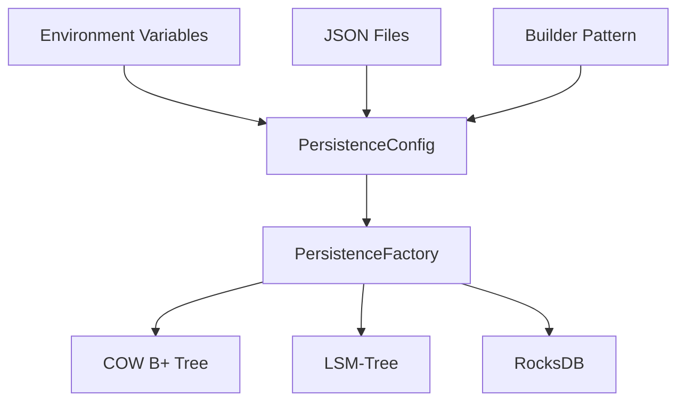
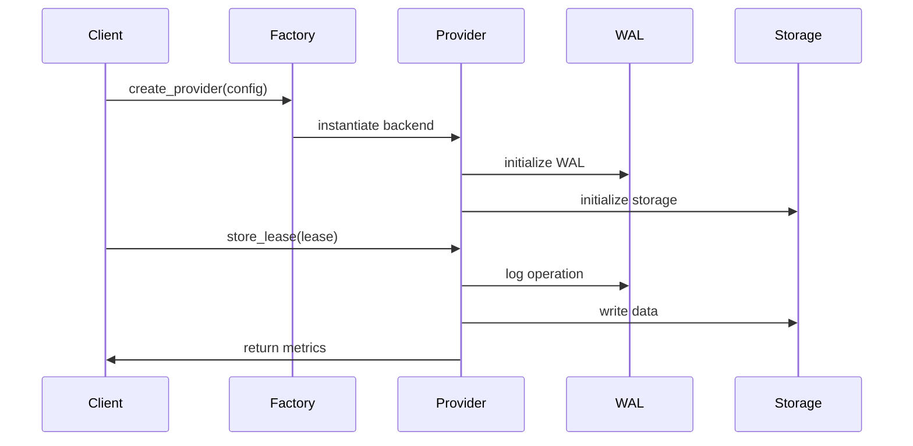
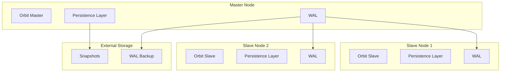

# Orbit-RS Persistence Layer Architecture

## Overview

The Orbit-RS persistence layer provides three configurable backend options for actor lease storage, each optimized for different use cases:

1. **COW B+ Tree** - Ultra-low latency, memory-optimized
2. **LSM-Tree** - Write-optimized with background compaction
3. **RocksDB** - Production-proven with rich features

## Architecture Components

### Configuration System



### Data Flow



## Backend Comparison

| Feature | COW B+ Tree | LSM-Tree | RocksDB |
|---------|-------------|----------|---------|
| **Write Latency** | ~41μs | ~38μs | ~53μs |
| **Read Latency** | <1μs | ~0.3μs | ~19μs |
| **Memory Usage** | Low | Medium | High |
| **Disk Usage** | Low | Medium (write amp) | High (write amp) |
| **CPU Usage** | Low | Medium (compaction) | High |
| **Crash Recovery** | WAL Replay | WAL + SSTable | Built-in |
| **Production Ready** | ⚠️  Beta | ⚠️  Beta | ✅ Stable |

## File Structure

### COW B+ Tree

```text
data/
├── orbit.wal              # Write-Ahead Log
├── snapshots/             # Periodic snapshots
│   ├── snapshot_1234567890.json
│   └── ...
└── metadata.json          # Tree metadata
```

### LSM-Tree

```text
data/
├── wal.log                # Write-Ahead Log
├── sstables/              # Sorted String Tables
│   ├── level_0_1234567890_12345.sst
│   ├── level_1_1234567891_12346.sst
│   └── ...
└── manifest.json          # Level metadata
```

### RocksDB

```text
data/
├── CURRENT                # Current manifest pointer
├── MANIFEST-000001        # Database metadata
├── 000003.log             # Write-Ahead Log
├── 000004.sst             # SSTable files
├── LOCK                   # Database lock
└── OPTIONS-000005         # Configuration
```

## Configuration Options

### Environment Variables

```bash

# Backend selection
export ORBIT_PERSISTENCE_BACKEND=cow  # or lsm, rocksdb

# Data directory
export ORBIT_DATA_DIR=/var/lib/orbit

# COW B+ Tree settings
export ORBIT_COW_MAX_KEYS=64
export ORBIT_COW_WAL_BUFFER_SIZE=1048576

# LSM-Tree settings
export ORBIT_LSM_MEMTABLE_SIZE_MB=64
export ORBIT_LSM_MAX_LEVELS=7
export ORBIT_LSM_ENABLE_BLOOM_FILTERS=true
export ORBIT_LSM_COMPACTION_THRESHOLD=4

# RocksDB settings
export ORBIT_ROCKSDB_COMPRESSION=true
export ORBIT_ROCKSDB_BLOCK_CACHE_MB=256
```

### JSON Configuration

```json
{
  "backend": "LsmTree",
  "data_dir": "/var/lib/orbit",
  "cow_config": {
    "max_keys_per_node": 64,
    "wal_buffer_size": 1048576,
    "enable_snapshots": true,
    "snapshot_interval": 1000
  },
  "lsm_config": {
    "memtable_size_mb": 64,
    "max_levels": 7,
    "level_size_multiplier": 10,
    "compaction_threshold": 4,
    "sstable_block_size_kb": 4,
    "enable_bloom_filters": true,
    "bloom_filter_bits_per_key": 10,
    "enable_compression": true,
    "write_buffer_mb": 32,
    "block_cache_mb": 256
  },
  "rocksdb_config": {
    "compression": true,
    "block_cache_mb": 256,
    "write_buffer_mb": 64,
    "max_background_jobs": 4
  }
}
```

### Programmatic Configuration

```rust
use persistence_benchmark::persistence_factory::PersistenceConfigBuilder;
use persistence_benchmark::config::PersistenceBackend;

// High-performance configuration
let provider = PersistenceConfigBuilder::new()
    .backend(PersistenceBackend::CowBTree)
    .data_dir("/var/lib/orbit")
    .cow_max_keys(128)
    .cow_wal_buffer_size(2 * 1024 * 1024)
    .create_provider()
    .await?;

// Write-heavy workload configuration
let provider = PersistenceConfigBuilder::new()
    .backend(PersistenceBackend::LsmTree)
    .data_dir("/var/lib/orbit")
    .lsm_memtable_size(128)
    .lsm_max_levels(6)
    .lsm_enable_bloom_filters(true)
    .lsm_compaction_threshold(8)
    .create_provider()
    .await?;
```

## Performance Tuning

### COW B+ Tree Tuning

```toml

# For read-heavy workloads
max_keys_per_node = 256        # Larger nodes, fewer levels
wal_buffer_size = 512000       # Smaller buffer, frequent flushes
enable_snapshots = true
snapshot_interval = 500        # More frequent snapshots

# For memory-constrained environments
max_keys_per_node = 32         # Smaller nodes
wal_buffer_size = 65536        # Small buffer
enable_snapshots = false       # Disable snapshots
```

### LSM-Tree Tuning

```toml

# For write-heavy workloads
memtable_size_mb = 128         # Large memtables
max_levels = 8                 # More levels
level_size_multiplier = 8      # Smaller multiplier
compaction_threshold = 10      # Less frequent compaction

# For read-heavy workloads
memtable_size_mb = 32          # Smaller memtables
enable_bloom_filters = true    # Enable bloom filters
bloom_filter_bits_per_key = 15 # More accurate filters
block_cache_mb = 512           # Large block cache
```

## Monitoring and Metrics

### Key Metrics to Monitor

```rust
// Performance metrics returned by all operations
pub struct PersistenceMetrics {
    pub operation_type: OperationType,
    pub latency: Duration,              // ⚠️  Monitor for spikes
    pub memory_used: u64,               // 📊 Track memory growth
    pub disk_bytes_read: u64,           // 📈 I/O patterns
    pub disk_bytes_written: u64,        // 📈 Write amplification
    pub success: bool,                  // 🚨 Error rates
}

// Storage statistics
pub struct StorageStats {
    pub total_keys: u64,                // 📊 Data size
    pub total_size_bytes: u64,          // 💾 Storage usage
    pub memory_usage_bytes: u64,        // 🧠 Memory footprint
    pub disk_usage_bytes: u64,          // 💾 Disk footprint
    pub average_key_size: u64,          // 📏 Data patterns
    pub average_value_size: u64,        // 📏 Value sizes
}
```

### Alerting Thresholds

```yaml

# Recommended alert thresholds
write_latency_p95: 100ms      # 95th percentile write latency
read_latency_p95: 10ms        # 95th percentile read latency
error_rate: 0.1%              # Error rate threshold
memory_usage: 80%             # Memory usage threshold
disk_usage: 85%               # Disk usage threshold
compaction_backlog: 10        # LSM compaction queue size
```

## High Availability Setup

### Master-Slave Replication



### Clustering Configuration

```yaml

# docker-compose.yml
version: '3.8'
services:
  orbit-master:
    image: orbit-rs:latest
    environment:
      - ORBIT_PERSISTENCE_BACKEND=cow
      - ORBIT_DATA_DIR=/data
      - ORBIT_COW_WAL_BUFFER_SIZE=2097152
      - ORBIT_REPLICATION_MODE=master
    volumes:
      - master-data:/data
      - ./config.json:/etc/orbit/config.json
    ports:
      - "8080:8080"
    
  orbit-slave-1:
    image: orbit-rs:latest
    environment:
      - ORBIT_PERSISTENCE_BACKEND=cow
      - ORBIT_DATA_DIR=/data
      - ORBIT_REPLICATION_MODE=slave
      - ORBIT_MASTER_URL=orbit-master:8080
    volumes:
      - slave1-data:/data
    depends_on:
      - orbit-master
      
  orbit-slave-2:
    image: orbit-rs:latest
    environment:
      - ORBIT_PERSISTENCE_BACKEND=cow
      - ORBIT_DATA_DIR=/data
      - ORBIT_REPLICATION_MODE=slave
      - ORBIT_MASTER_URL=orbit-master:8080
    volumes:
      - slave2-data:/data
    depends_on:
      - orbit-master

volumes:
  master-data:
  slave1-data:
  slave2-data:
```

## Security Considerations

### Data Encryption

```rust
// Configure encryption for sensitive data
let config = PersistenceConfigBuilder::new()
    .backend(PersistenceBackend::LsmTree)
    .data_dir("/var/lib/orbit")
    .enable_encryption(true)                    // Encrypt at rest
    .encryption_key_path("/etc/orbit/key.pem")  // Key location
    .create_provider()
    .await?;
```

### Access Control

```yaml

# File permissions
/var/lib/orbit/:
  owner: orbit:orbit
  permissions: 0750

/var/lib/orbit/config.json:
  owner: orbit:orbit
  permissions: 0640
  
/etc/orbit/key.pem:
  owner: orbit:orbit
  permissions: 0600
```

### Network Security

```yaml

# Firewall rules (iptables)
-A INPUT -p tcp --dport 8080 -s 10.0.0.0/8 -j ACCEPT     # Internal network only
-A INPUT -p tcp --dport 8080 -j DROP                      # Block external access
-A INPUT -p tcp --dport 9090 -s 127.0.0.1 -j ACCEPT      # Metrics localhost only
```

## Capacity Planning

### Resource Requirements

| Backend | CPU Cores | Memory (GB) | Disk IOPS | Network (Mbps) |
|---------|-----------|-------------|-----------|----------------|
| **COW B+ Tree** | 2-4 | 4-8 | 1,000-5,000 | 100-500 |
| **LSM-Tree** | 4-8 | 8-16 | 5,000-20,000 | 500-1,000 |
| **RocksDB** | 8-16 | 16-32 | 10,000-50,000 | 1,000-2,000 |

### Scaling Guidelines

```bash

# Horizontal scaling triggers
if [ $(get_write_latency_p95) -gt 100 ]; then
    echo "Scale out: Add more nodes"
fi

if [ $(get_memory_usage) -gt 80 ]; then
    echo "Scale up: Add more memory"
fi

if [ $(get_disk_usage) -gt 85 ]; then
    echo "Scale storage: Add more disk capacity"
fi
```

## Testing and Validation

### Integration Tests

```rust

#[tokio::test]
async fn test_backend_switching() {
    let backends = vec![
        PersistenceBackend::CowBTree,
        PersistenceBackend::LsmTree,
        PersistenceBackend::RocksDb,
    ];
    
    for backend in backends {
        let provider = PersistenceFactory::create_default(
            backend, 
            &temp_dir.path()
        ).await.unwrap();
        
        // Test basic operations
        test_basic_operations(&provider).await;
        test_crash_recovery(&provider).await;
        test_performance_benchmarks(&provider).await;
    }
}
```

### Performance Benchmarking

```bash

# Run comprehensive benchmarks
cargo bench --features benchmarks

# Specific backend benchmarks
ORBIT_PERSISTENCE_BACKEND=cow cargo bench -- cow_btree
ORBIT_PERSISTENCE_BACKEND=lsm cargo bench -- lsm_tree
ORBIT_PERSISTENCE_BACKEND=rocksdb cargo bench -- rocksdb
```

### Load Testing

```yaml

# k6 load testing script
scenarios:
  write_heavy:
    executor: ramping-vus
    startVUs: 10
    stages:
      - duration: 5m
        target: 100
    exec: write_test
    
  read_heavy:
    executor: constant-vus
    vus: 50
    duration: 10m
    exec: read_test
```

## Version Compatibility

### Upgrade Path

| From Version | To Version | Migration Required | Downtime |
|--------------|------------|-------------------|-----------|
| 1.0.x | 1.1.x | No | Zero |
| 1.x.x | 2.0.x | Yes | Planned |
| COW → LSM | N/A | Export/Import | Planned |
| LSM → RocksDB | N/A | Export/Import | Planned |

### Data Migration

```bash

# Export from COW B+ Tree
orbit-cli export --backend=cow --data-dir=/var/lib/orbit --output=export.json

# Import to LSM-Tree
orbit-cli import --backend=lsm --data-dir=/var/lib/orbit-new --input=export.json

# Validate migration
orbit-cli validate --backend=lsm --data-dir=/var/lib/orbit-new
```

## Best Practices

### Development

1. **Always use transactions** for multi-operation consistency
2. **Implement proper error handling** for all persistence operations
3. **Monitor metrics** in development to catch performance regressions
4. **Test with realistic data sizes** to validate performance assumptions
5. **Use builder pattern** for configuration to ensure type safety

### Production

1. **Enable monitoring** for all key metrics
2. **Set up automated backups** of WAL and snapshots
3. **Test disaster recovery procedures** regularly
4. **Use appropriate backend** for your workload characteristics
5. **Configure resource limits** to prevent resource exhaustion
6. **Implement graceful degradation** for persistence failures

### DevOps

1. **Automate deployment** with configuration validation
2. **Use infrastructure as code** for reproducible environments
3. **Implement blue-green deployments** for zero-downtime updates
4. **Set up comprehensive monitoring** and alerting
5. **Document runbooks** for common operational procedures
6. **Regular capacity planning reviews** based on growth trends