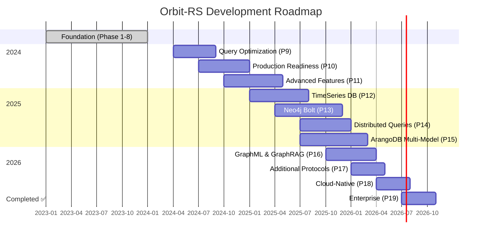

# Orbit-RS Development Roadmap

**Strategic Vision & Implementation Timeline**

---

## 📍 Navigation

- [🏠 **Documentation Home**](index.md)
- [📊 **Current Status**](status.md)
- [🎯 **Quick Start**](quick_start.md)
- [🏗️ **Architecture**](overview.md)

---

## 📈 Progress Overview

### 🎯 **Current Milestone: Phase 8 Complete**

**SQL Query Engine with Vector Operations**

Orbit-RS has successfully completed Phase 8, delivering a comprehensive SQL engine with advanced vector database capabilities. This represents **42% completion** of the total roadmap.

| Metric | Status |
|--------|--------|
| **Development Phases** | 8 of 19 complete (42%) |
| **GitHub Issues Tracked** | 68+ issues across remaining phases |
| **Estimated Remaining Time** | ~3.6-4.7 years |
| **Core Functionality** | Production-ready SQL & vector operations |

---

## ✅ Completed Phases

### Phase 1: Foundation *(Complete)*

**Multi-crate workspace with comprehensive testing**

- ✅ Workspace organization and cross-platform support
- ✅ Shared data structures and error handling  
- ✅ Testing framework with BDD scenarios
- ✅ CI/CD pipeline with security scanning

### Phase 2: Core Actor System *(Complete)*

**Distributed actor model with lifecycle management**

- ✅ Actor traits with string/UUID addressing
- ✅ Lifecycle management and proxy generation
- ✅ Message routing and lease system
- ✅ Comprehensive error propagation

### Phase 3: Network Layer *(Complete)*

**gRPC services with Protocol Buffers**

- ✅ Service definitions and message types
- ✅ Connection pooling and retry logic
- ✅ DNS and etcd-based service discovery
- ✅ Circuit breakers and failover

### Phase 4: Cluster Management *(Complete)*

**Automatic cluster operations and health monitoring**

- ✅ Node registration and discovery
- ✅ Dynamic membership management
- ✅ Load balancing strategies
- ✅ Raft-based leader election

### Phase 5: Advanced Transaction System *(Complete)*

**ACID compliance with distributed coordination**

- ✅ 2-Phase commit protocol
- ✅ Saga pattern for long-running workflows
- ✅ Distributed lock management
- ✅ SQLite-based audit trail

### Phase 6: Protocol Adapters *(Complete)*

**Multi-protocol database compatibility**

- ✅ **Redis RESP Protocol**: 50+ commands
- ✅ **PostgreSQL Wire Protocol**: Complete DDL support
- ✅ **Vector Operations**: pgvector compatibility
- ✅ **SQL Parser**: Lexer, AST, and expressions

### Phase 7: Kubernetes Integration *(Complete)*

**Cloud-native deployment and operations**

- ✅ Custom Kubernetes operator with CRDs
- ✅ Production Helm charts
- ✅ Multi-platform Docker images
- ✅ Service mesh integration

### Phase 7.5: AI Integration *(Complete)*

**Model Context Protocol for AI agents**

- ✅ MCP server implementation
- ✅ Request routing and response formatting
- ✅ SQL integration for AI agents
- ✅ Actor management through MCP

### Phase 8: SQL Query Engine *(Complete)* 🎉

**Enterprise-grade SQL with vector database**

- ✅ **DDL/DCL/TCL Operations**: Complete schema management
- ✅ **Advanced DML**: JOINs, subqueries, CTEs, window functions
- ✅ **Vector Database**: HNSW/IVFFLAT similarity search
- ✅ **Expression Parser**: Full operator precedence
- ✅ **PostgreSQL Compatibility**: Standard client support

---

## 🚀 Upcoming Phases

### 🎯 **Phase 9: Query Optimization & Performance** *(Q2 2024)*

**Transform into high-performance enterprise database**

**Duration:** 19-25 weeks | **Priority:** High | **Team Size:** 8-12 engineers

#### Key Deliverables

- **🧠 Cost-Based Query Planner**
  - Statistics collection and cardinality estimation
  - Rule-based and cost-based optimization
  - Alternative plan generation and selection
- **⚡ Vectorized Execution Engine**
  - SIMD-optimized batch processing (AVX2/AVX-512)
  - Columnar data layouts and operations
  - 10x performance improvement target
- **🔄 Parallel Query Processing**
  - Multi-threaded execution across cores
  - NUMA-aware scheduling and work-stealing
  - Pipeline and partition parallelism
- **🎯 Intelligent Index System**
  - Automatic index selection and recommendations
  - Index usage tracking and optimization
  - Support for B-tree, hash, bitmap, and vector indexes
- **🚀 Multi-Level Query Caching**
  - Result, plan, and metadata caching
  - Intelligent invalidation and prefetching
  - 95% cache hit rate target

#### Performance Targets

- **5M+ queries/second** for simple operations
- **50x improvement** for complex analytical queries  
- **Linear scalability** up to 16 CPU cores
- **Sub-100ms latency** for complex JOINs

[📋 **View Detailed Phase 9 Plan**](_phases/phase-09-query-optimization.md)

---

### 🏭 **Phase 10: Production Readiness** *(Q3 2024)*

**Enterprise operations and reliability**

**Duration:** 21-29 weeks | **Priority:** High | **Team Size:** 10-15 engineers

#### Key Deliverables

- **🔌 Advanced Connection Pooling**
  - Multi-tier pooling with health monitoring
  - Circuit breakers and intelligent load balancing
  - Connection affinity and geographic routing
- **📊 Production Monitoring & Metrics**
  - Comprehensive observability stack
  - Prometheus/Grafana integration
  - Automated remediation and alerting
- **💾 Backup & Recovery Systems**
  - Point-in-time recovery with cross-region replication
  - Multiple backup types and verification
  - Automated disaster recovery procedures
- **🏗️ High Availability Architecture**
  - Multi-node clustering with automatic failover
  - Zero-downtime maintenance and rolling updates
  - Geographic distribution and split-brain prevention
- **🔐 Advanced Security Framework**
  - LDAP/SAML/OAuth2 integration
  - Fine-grained RBAC and policy engine
  - Comprehensive auditing and threat detection

#### Reliability Targets

- **99.99% uptime** (43.2 minutes downtime/year)
- **<30 second failover** time for node failures
- **11 9's data durability** with cross-region replication

[📋 **View Detailed Phase 10 Plan**](_phases/phase-10-production-readiness.md)

---

### 🎛️ **Phase 11: Advanced Features** *(Q4 2024)*

**Modern database capabilities**

**Duration:** 25-31 weeks | **Priority:** High | **Team Size:** 8-12 engineers

#### Key Deliverables

- **📜 Stored Procedures & Functions**
  - PL/pgSQL procedural language support
  - User-defined functions and triggers
  - Recursive and aggregate functions
- **🎯 Database Triggers**
  - Event-driven actions with cascading support
  - Row and statement-level triggers
  - Trigger chaining and conditional execution
- **🔍 Full-Text Search**
  - Advanced text search with multiple languages
  - Ranking algorithms and faceted search
  - GIN and GiST index support
- **📋 Enhanced JSON/JSONB**
  - Binary storage with path expressions
  - JSON aggregation and manipulation functions
  - Schema validation and indexing
- **📡 Streaming & Change Data Capture**
  - Real-time data streaming with Kafka integration
  - Change data capture with event sourcing
  - Stream processing and materialized views

**Phase 11 Plan** - Detailed plan in development

---

### 📈 **Phase 12: Time Series Database** *(Q1 2025)*

**High-performance time-series capabilities**

**Duration:** 22-34 weeks | **Priority:** High | **Team Size:** 6-10 engineers

#### Key Deliverables

- **⏱️ Redis TimeSeries Compatibility**
  - TS.* command implementation
  - Aggregation rules and downsampling
  - Multi-series operations and compaction
- **📊 PostgreSQL TimescaleDB Extensions**
  - Hypertables and time-partitioned tables
  - Time functions and continuous aggregates
  - Compression and analytical functions
- **⚡ Performance Optimizations**
  - Columnar storage for time-series data
  - Parallel ingestion and query processing
  - 1M+ samples/second ingestion target

**Phase 12 Plan** - Detailed plan in development

---

### 🕸️ **Phase 13: Neo4j Bolt Protocol** *(Q2 2025)*

**Complete graph database compatibility**

**Duration:** 30-36 weeks | **Priority:** High | **Team Size:** 12-18 engineers

#### Key Deliverables

- **🔗 Neo4j Foundation** (12-14 weeks)
  - Core graph actors and Bolt protocol v4.4
  - Connection management and basic Cypher
  - Graph storage optimized for traversals
- **🧠 Advanced Graph Operations** (10-12 weeks)
  - Complete Cypher language support
  - Built-in graph algorithms (PageRank, centrality)
  - Schema management and constraints
- **🎯 Enterprise Graph Features** (8-10 weeks)
  - Graph Data Science and ML algorithms
  - Performance optimization and scaling
  - Neo4j ecosystem compatibility

#### Performance Targets

- **50K+ graph queries/second**
- **100M+ nodes** support with linear scaling
- **Sub-millisecond** traversal operations

**Phase 13 Plan** - Detailed plan in development

---

### 🔄 **Phase 14: Distributed Query Processing** *(Q3 2025)*

**Cross-node query optimization**

**Duration:** 18-24 weeks | **Priority:** Medium | **Team Size:** 8-12 engineers

#### Key Deliverables

- **🌐 Distributed Query Engine**
  - Cost-based optimization across nodes
  - Cross-node execution planning
  - Data locality and network optimization
- **📊 Advanced Time Series Analytics**
  - Real-time processing with ML integration
  - Distributed aggregation and windowing
  - Time-series forecasting capabilities
- **⚖️ Data Sharding & Replication**
  - Intelligent partitioning strategies
  - Automatic rebalancing and migration
  - Consistency and availability trade-offs

**Phase 14 Plan** - Detailed plan in development

---

### 🗄️ **Phase 15: ArangoDB Multi-Model** *(Q3 2025)*

**Unified multi-model database**

**Duration:** 36-42 weeks | **Priority:** High | **Team Size:** 15-20 engineers

#### Key Deliverables

- **🏗️ ArangoDB Foundation** (14-16 weeks)
  - Multi-model core actors (document, graph, key-value)
  - Complete AQL query engine
  - ACID transactions across data models
- **📚 Advanced Multi-Model Operations** (12-14 weeks)
  - Document database with schema validation
  - Property graphs with smart graph features
  - Full-text search with analyzers
- **🌍 Enterprise Multi-Model Features** (10-12 weeks)
  - Geospatial support with routing
  - Streaming analytics and ML integration
  - ArangoDB ecosystem compatibility

#### Performance Targets

- **100K+ document operations/second**
- **10K+ graph traversals/second**
- **Multi-model ACID transactions**

**Phase 15 Plan** - Detailed plan in development

---

### 🤖 **Phase 16: GraphML & GraphRAG** *(Q4 2025 - Q1 2026)*

**AI-powered graph analytics**

**Duration:** 28-34 weeks | **Priority:** High | **Team Size:** 12-18 engineers

#### Key Deliverables

- **🧠 GraphML & Advanced Analytics** (14-16 weeks)
  - Node embeddings (Node2Vec, GraphSAGE)
  - Graph Neural Networks (GCN, GAT)
  - Community detection and anomaly detection
- **🔍 GraphRAG & Knowledge Reasoning** (14-18 weeks)
  - Knowledge graph construction from text
  - Graph-augmented generation capabilities
  - Multi-hop reasoning and inference engines
- **⚡ Performance & Integration**
  - Distributed ML training across cluster
  - Real-time inference and embedding updates
  - Vector database integration

**Phase 16 Plan** - Detailed plan in development

---

### 🔌 **Phase 17: Additional Protocol Support** *(Q1 2026)*

**Extended protocol compatibility**

**Duration:** 16-20 weeks | **Priority:** Medium | **Team Size:** 8-12 engineers

#### Key Deliverables

- **🌐 REST & GraphQL APIs**
  - OpenAPI/Swagger documentation
  - Real-time subscriptions and introspection
- **⚡ Real-time & Streaming**
  - WebSocket bidirectional communication
  - Apache Kafka integration
  - InfluxDB line protocol support
- **📄 Document Compatibility**
  - MongoDB wire protocol layer
  - Document validation and indexing

**Phase 17 Plan** - Detailed plan in development

---

### ☁️ **Phase 18: Cloud-Native Features** *(Q2 2026)*

**Multi-cloud and edge deployment**

**Duration:** 14-18 weeks | **Priority:** Medium | **Team Size:** 10-15 engineers

#### Key Deliverables

- **🌍 Multi-Cloud Support**
  - AWS, Azure, Google Cloud deployment
  - Auto-scaling and cost optimization
  - Serverless integration capabilities
- **🌐 Edge Computing**
  - Edge node deployment patterns
  - Data synchronization and caching
  - Reduced latency for global users

**Phase 18 Plan** - Detailed plan in development

---

### 🏢 **Phase 19: Enterprise Features** *(Q3 2026)*

**Enterprise integration and support**

**Duration:** 12-16 weeks | **Priority:** Medium | **Team Size:** 8-12 engineers

#### Key Deliverables

- **🔒 Advanced Security & Compliance**
  - SOC2, GDPR, HIPAA compliance frameworks
  - Enterprise identity integration
  - Advanced auditing capabilities
- **🔧 Migration & Support Tools**
  - Database migration utilities
  - Professional services framework
  - Enterprise support infrastructure

**Phase 19 Plan** - Detailed plan in development

---

## 📊 Resource Planning

### 👥 **Team Scaling**

| Phase | Core Team | Extended Team | Specialists |
|-------|-----------|---------------|-------------|
| **Phase 9** | 8 engineers | +4 performance | Query optimization experts |
| **Phase 10** | 10 engineers | +5 operations | SRE and security specialists |
| **Phase 11** | 8 engineers | +4 database | PL/SQL and search experts |
| **Phase 12** | 6 engineers | +4 analytics | Time-series specialists |
| **Phase 13** | 12 engineers | +6 graph | Neo4j and Cypher experts |

### 💰 **Investment Timeline**

- **2024:** $3.2M - Performance optimization and production readiness
- **2025:** $4.8M - Graph database and multi-model capabilities  
- **2026:** $2.1M - Cloud-native and enterprise features
- **Total:** $10.1M over 3 years for complete roadmap

### 🎯 **Success Metrics**

- **Performance:** 10x query performance improvement by end of 2024
- **Market Share:** 5% of distributed database market by 2026
- **Enterprise Adoption:** 100+ enterprise customers by end of roadmap
- **Community:** 10K+ GitHub stars and 500+ contributors

---

## 🗺️ Visual Timeline

---

## 📈 Key Milestones

### 🎯 **2024 Milestones**

- **Q2 2024:** Phase 9 complete - 10x query performance improvement
- **Q3 2024:** Phase 10 complete - Production-ready with 99.99% uptime
- **Q4 2024:** Phase 11 complete - Advanced database features

### 🚀 **2025 Milestones**  

- **Q1 2025:** Phase 12 complete - Time-series database capabilities
- **Q2 2025:** Phase 13 complete - Neo4j Bolt protocol compatibility
- **Q3 2025:** Phases 14-15 complete - Distributed queries & multi-model

### 🌟 **2026 Milestones**

- **Q1 2026:** Phase 16 complete - GraphML & GraphRAG capabilities
- **Q3 2026:** All phases complete - Full enterprise-ready platform
- **Q4 2026:** 1.0 Release - Production deployment at scale

---

## 🤝 Get Involved

### 📋 **Track Progress**

- [📊 **GitHub Project Board**](https://github.com/TuringWorks/orbit-rs/projects) - Real-time progress tracking
- [📈 **Weekly Status Updates**](status.md) - Detailed development progress
- [💬 **Discord Updates**](https://discord.gg/orbit-rs) - Live development discussions

### 🚀 **Contribute**

- [🐛 **Report Issues**](https://github.com/TuringWorks/orbit-rs/issues) - Bug reports and feature requests
- [🤝 **Pull Requests**](contributing.md) - Code contributions and improvements
- [📝 **Documentation**](contributing.md#documentation) - Help improve documentation

### 💼 **Enterprise Partnership**

- [📧 **Contact Sales**](mailto:enterprise@turingworks.com) - Enterprise deployment planning
- [🤝 **Technology Partnership**](mailto:partnerships@turingworks.com) - Integration and development partnerships
- [💰 **Funding Opportunities**](mailto:funding@turingworks.com) - Investment and sponsorship options

---

**📍 Navigation:**  
[🏠 Home](index.md) | [📊 Status](status.md) | [🏗️ Architecture](overview.md) | [🚀 Quick Start](quick_start.md)

**🔗 Quick Links:**  
[GitHub](https://github.com/TuringWorks/orbit-rs) | [Discord](https://discord.gg/orbit-rs) | [Documentation](index.md)

