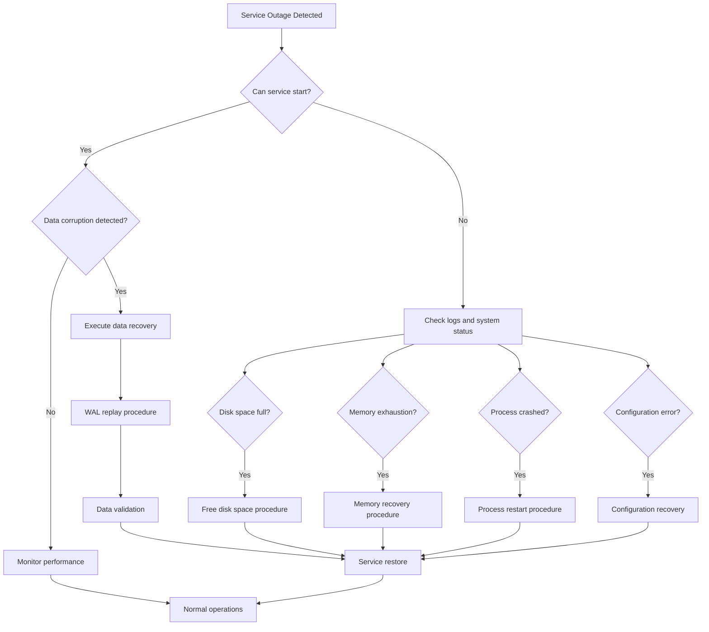

# Orbit-RS Persistence Layer Disaster Recovery Guide

## Overview

This guide provides comprehensive disaster recovery procedures for Orbit-RS persistence layer failures. It covers all three backends (COW B+ Tree, LSM-Tree, RocksDB) and includes step-by-step recovery procedures for various failure scenarios.

## 🚨 Emergency Response Flowchart



## Failure Classification

### Severity Levels

| Level | Description | Response Time | Impact |
|-------|-------------|---------------|--------|
| **P0** | Complete service outage | < 15 minutes | All users affected |
| **P1** | Partial service degradation | < 1 hour | Some users affected |
| **P2** | Performance issues | < 4 hours | Reduced performance |
| **P3** | Minor issues | < 24 hours | Minimal impact |

### Common Failure Scenarios

1. **Data Corruption** - P0
2. **Disk Space Exhaustion** - P0/P1
3. **Memory Exhaustion** - P1
4. **Process Crashes** - P1
5. **Configuration Errors** - P1
6. **Hardware Failures** - P0
7. **Network Partitions** - P1
8. **WAL Corruption** - P0
9. **Compaction Failures** - P2
10. **Performance Degradation** - P2/P3

## Pre-Incident Preparation

### Backup Strategy

```bash
#!/bin/bash
# Daily backup script - Run via cron
# 0 2 * * * /usr/local/bin/orbit-backup.sh

BACKUP_DIR="/backup/orbit/$(date +%Y-%m-%d)"
DATA_DIR="/var/lib/orbit"
S3_BUCKET="orbit-backups-prod"

# Create backup directory
mkdir -p "$BACKUP_DIR"

# Backup configuration
cp /etc/orbit/config.json "$BACKUP_DIR/"
cp -r /etc/orbit/keys "$BACKUP_DIR/"

# Backend-specific backups
BACKEND=$(grep -o '"backend": "[^"]*' /etc/orbit/config.json | cut -d'"' -f4)

case "$BACKEND" in
    "CowBTree")
        backup_cow_btree
        ;;
    "LsmTree")
        backup_lsm_tree
        ;;
    "RocksDb")
        backup_rocksdb
        ;;
esac

# Upload to S3
aws s3 sync "$BACKUP_DIR" "s3://$S3_BUCKET/$(date +%Y-%m-%d)/"

# Cleanup old local backups (keep 7 days)
find /backup/orbit -type d -mtime +7 -exec rm -rf {} \;
```

#### COW B+ Tree Backup

```bash
backup_cow_btree() {
    echo "Backing up COW B+ Tree data..."
    
    # Stop writes temporarily (if possible)
    systemctl stop orbit-rs || true
    
    # Copy WAL and snapshots
    cp -r "$DATA_DIR/orbit.wal" "$BACKUP_DIR/"
    cp -r "$DATA_DIR/snapshots" "$BACKUP_DIR/"
    cp -r "$DATA_DIR/metadata.json" "$BACKUP_DIR/"
    
    # Create consistency snapshot
    orbit-cli snapshot create --output="$BACKUP_DIR/emergency_snapshot.json"
    
    # Restart service
    systemctl start orbit-rs
    
    echo "COW B+ Tree backup completed"
}
```

#### LSM-Tree Backup

```bash
backup_lsm_tree() {
    echo "Backing up LSM-Tree data..."
    
    # Flush memtables
    orbit-cli flush-memtables
    
    # Copy all SSTables and WAL
    cp -r "$DATA_DIR/wal.log" "$BACKUP_DIR/"
    cp -r "$DATA_DIR/sstables" "$BACKUP_DIR/"
    cp -r "$DATA_DIR/manifest.json" "$BACKUP_DIR/"
    
    # Create manifest backup
    orbit-cli export-manifest --output="$BACKUP_DIR/manifest_backup.json"
    
    echo "LSM-Tree backup completed"
}
```

#### RocksDB Backup

```bash
backup_rocksdb() {
    echo "Backing up RocksDB data..."
    
    # Use RocksDB's built-in backup
    orbit-cli rocksdb-backup --checkpoint-dir="$BACKUP_DIR/checkpoint"
    
    # Copy current state
    cp -r "$DATA_DIR"/* "$BACKUP_DIR/"
    
    echo "RocksDB backup completed"
}
```

### Monitoring Setup

```yaml
# prometheus.yml
global:
  scrape_interval: 15s
  evaluation_interval: 15s

rule_files:
  - "orbit_alerts.yml"

scrape_configs:
  - job_name: 'orbit-rs'
    static_configs:
      - targets: ['localhost:9090']
    metrics_path: /metrics
    scrape_interval: 5s

alerting:
  alertmanagers:
    - static_configs:
        - targets:
          - alertmanager:9093
```

```yaml
# orbit_alerts.yml
groups:
- name: orbit-persistence
  rules:
  - alert: OrbitHighWriteLatency
    expr: orbit_write_latency_p95 > 100000  # 100ms in microseconds
    for: 2m
    labels:
      severity: warning
    annotations:
      summary: "High write latency detected"
      description: "95th percentile write latency is {{ $value }}μs"

  - alert: OrbitHighReadLatency
    expr: orbit_read_latency_p95 > 50000   # 50ms in microseconds
    for: 2m
    labels:
      severity: warning
    annotations:
      summary: "High read latency detected"
      description: "95th percentile read latency is {{ $value }}μs"

  - alert: OrbitDiskSpaceLow
    expr: orbit_disk_usage_percent > 85
    for: 5m
    labels:
      severity: critical
    annotations:
      summary: "Disk space critically low"
      description: "Disk usage is {{ $value }}%"

  - alert: OrbitMemoryHigh
    expr: orbit_memory_usage_percent > 90
    for: 2m
    labels:
      severity: critical
    annotations:
      summary: "Memory usage critically high"
      description: "Memory usage is {{ $value }}%"

  - alert: OrbitServiceDown
    expr: up{job="orbit-rs"} == 0
    for: 30s
    labels:
      severity: critical
    annotations:
      summary: "Orbit service is down"
      description: "Orbit service has been down for 30 seconds"

  - alert: OrbitErrorRateHigh
    expr: rate(orbit_operation_errors_total[5m]) > 0.01
    for: 2m
    labels:
      severity: warning
    annotations:
      summary: "High error rate detected"
      description: "Error rate is {{ $value }} errors/second"
```

### Health Check Endpoints

```rust
// Health check implementation
use axum::{http::StatusCode, Json};
use serde_json::{json, Value};

pub async fn health_check(
    persistence: &dyn PersistenceProvider
) -> Result<Json<Value>, StatusCode> {
    // Basic connectivity test
    match persistence.get_stats().await {
        Ok(stats) => {
            let health = json!({
                "status": "healthy",
                "backend": get_backend_name(),
                "stats": {
                    "total_keys": stats.total_keys,
                    "memory_usage_mb": stats.memory_usage_bytes / 1024 / 1024,
                    "disk_usage_mb": stats.disk_usage_bytes / 1024 / 1024
                },
                "timestamp": chrono::Utc::now()
            });
            Ok(Json(health))
        }
        Err(e) => {
            let error = json!({
                "status": "unhealthy",
                "error": e.to_string(),
                "timestamp": chrono::Utc::now()
            });
            Err(StatusCode::SERVICE_UNAVAILABLE)
        }
    }
}

pub async fn readiness_check(
    persistence: &dyn PersistenceProvider
) -> Result<Json<Value>, StatusCode> {
    // Test actual operations
    let test_key = ActorKey::new(
        uuid::Uuid::new_v4(),
        "health_check".to_string()
    );
    
    let test_lease = ActorLease::new(
        test_key.actor_id,
        "health_check".to_string(),
        "health_node".to_string(),
        Duration::from_secs(60)
    );
    
    // Test write and read
    match persistence.store_lease(&test_lease).await {
        Ok(_) => {
            match persistence.get_lease(&test_key).await {
                Ok((Some(_), _)) => Ok(Json(json!({"status": "ready"}))),
                _ => Err(StatusCode::SERVICE_UNAVAILABLE)
            }
        }
        Err(_) => Err(StatusCode::SERVICE_UNAVAILABLE)
    }
}
```

## Recovery Procedures

### 1. Complete Service Outage (P0)

#### Immediate Response (0-15 minutes)

```bash
#!/bin/bash
# Emergency response script
set -euo pipefail

echo "=== ORBIT-RS EMERGENCY RESPONSE ==="
echo "Timestamp: $(date)"
echo "Responder: $USER"

# 1. Check service status
echo "1. Checking service status..."
systemctl status orbit-rs || echo "Service not running"

# 2. Check system resources
echo "2. Checking system resources..."
df -h /var/lib/orbit
free -h
ps aux | grep orbit

# 3. Check logs
echo "3. Recent error logs..."
journalctl -u orbit-rs --since "5 minutes ago" --no-pager | tail -50

# 4. Check network connectivity
echo "4. Network connectivity..."
ping -c 3 8.8.8.8 || echo "Network issues detected"

# 5. Quick restart attempt
echo "5. Attempting service restart..."
systemctl restart orbit-rs
sleep 10

# 6. Verify service
if systemctl is-active --quiet orbit-rs; then
    echo "✅ Service restarted successfully"
    echo "Running health check..."
    curl -f http://localhost:8080/health || echo "Health check failed"
else
    echo "❌ Service failed to restart - escalating to data recovery"
    echo "Calling data recovery procedure..."
    /usr/local/bin/orbit-data-recovery.sh
fi
```

#### Data Recovery Procedure

```bash
#!/bin/bash
# Data recovery script
set -euo pipefail

RECOVERY_LOG="/var/log/orbit-recovery-$(date +%Y%m%d-%H%M%S).log"
DATA_DIR="/var/lib/orbit"
BACKUP_DIR="/backup/orbit"

exec > >(tee -a "$RECOVERY_LOG")
exec 2>&1

echo "=== ORBIT-RS DATA RECOVERY ==="
echo "Started: $(date)"

# Stop service
echo "Stopping orbit service..."
systemctl stop orbit-rs

# Determine backend
BACKEND=$(get_backend_type "$DATA_DIR")
echo "Detected backend: $BACKEND"

# Backup current corrupt data
echo "Backing up potentially corrupt data..."
CORRUPT_BACKUP="/backup/corrupt-$(date +%Y%m%d-%H%M%S)"
mkdir -p "$CORRUPT_BACKUP"
cp -r "$DATA_DIR" "$CORRUPT_BACKUP/" || echo "Failed to backup corrupt data"

case "$BACKEND" in
    "COW")
        recover_cow_btree
        ;;
    "LSM")
        recover_lsm_tree
        ;;
    "ROCKSDB")
        recover_rocksdb
        ;;
    *)
        echo "Unknown backend: $BACKEND"
        exit 1
        ;;
esac

# Validate recovery
echo "Validating recovery..."
if validate_data_integrity "$DATA_DIR"; then
    echo "✅ Data recovery successful"
    systemctl start orbit-rs
    
    # Final health check
    sleep 10
    if health_check_passes; then
        echo "✅ Service fully restored"
        notify_success
    else
        echo "❌ Service started but health check failed"
        notify_partial_failure
    fi
else
    echo "❌ Data validation failed"
    notify_recovery_failure
    exit 1
fi
```

### 2. COW B+ Tree Recovery

```bash
recover_cow_btree() {
    echo "=== COW B+ Tree Recovery ==="
    
    # Find latest backup
    LATEST_BACKUP=$(find "$BACKUP_DIR" -name "*.json" -type d | sort -r | head -1)
    echo "Using backup: $LATEST_BACKUP"
    
    # Clear data directory
    rm -rf "$DATA_DIR"/*
    
    # Check WAL integrity
    if [ -f "$LATEST_BACKUP/orbit.wal" ]; then
        echo "WAL found - checking integrity..."
        if validate_wal_integrity "$LATEST_BACKUP/orbit.wal"; then
            echo "✅ WAL is valid - performing replay"
            
            # Copy WAL and metadata
            cp "$LATEST_BACKUP/orbit.wal" "$DATA_DIR/"
            cp "$LATEST_BACKUP/metadata.json" "$DATA_DIR/"
            
            # Initialize empty tree
            orbit-cli init --backend=cow --data-dir="$DATA_DIR"
            
            # The service will replay WAL on startup
            echo "✅ COW B+ Tree prepared for WAL replay"
        else
            echo "⚠️  WAL corrupted - using snapshot"
            restore_from_snapshot "$LATEST_BACKUP"
        fi
    else
        echo "⚠️  No WAL found - using snapshot"
        restore_from_snapshot "$LATEST_BACKUP"
    fi
}

restore_from_snapshot() {
    local backup_dir="$1"
    
    if [ -f "$backup_dir/emergency_snapshot.json" ]; then
        echo "Restoring from emergency snapshot..."
        orbit-cli restore --input="$backup_dir/emergency_snapshot.json" --data-dir="$DATA_DIR"
    elif [ -d "$backup_dir/snapshots" ]; then
        echo "Restoring from regular snapshots..."
        LATEST_SNAPSHOT=$(find "$backup_dir/snapshots" -name "*.json" | sort -r | head -1)
        orbit-cli restore --input="$LATEST_SNAPSHOT" --data-dir="$DATA_DIR"
    else
        echo "❌ No snapshots available - manual intervention required"
        exit 1
    fi
}

validate_wal_integrity() {
    local wal_file="$1"
    
    # Check file size
    if [ ! -s "$wal_file" ]; then
        echo "WAL file is empty"
        return 1
    fi
    
    # Basic format validation
    orbit-cli validate-wal --input="$wal_file" 2>/dev/null
}
```

### 3. LSM-Tree Recovery

```bash
recover_lsm_tree() {
    echo "=== LSM-Tree Recovery ==="
    
    LATEST_BACKUP=$(find "$BACKUP_DIR" -type d | sort -r | head -1)
    echo "Using backup: $LATEST_BACKUP"
    
    # Clear data directory
    rm -rf "$DATA_DIR"/*
    
    # Restore SSTables
    if [ -d "$LATEST_BACKUP/sstables" ]; then
        echo "Restoring SSTables..."
        cp -r "$LATEST_BACKUP/sstables" "$DATA_DIR/"
        
        # Validate SSTables
        echo "Validating SSTables..."
        for sstable in "$DATA_DIR/sstables"/*.sst; do
            if ! validate_sstable "$sstable"; then
                echo "⚠️  Corrupted SSTable: $sstable - removing"
                rm -f "$sstable"
            fi
        done
    fi
    
    # Restore manifest
    if [ -f "$LATEST_BACKUP/manifest.json" ]; then
        cp "$LATEST_BACKUP/manifest.json" "$DATA_DIR/"
    else
        echo "⚠️  No manifest - rebuilding from SSTables"
        rebuild_lsm_manifest "$DATA_DIR"
    fi
    
    # Check WAL
    if [ -f "$LATEST_BACKUP/wal.log" ]; then
        echo "Restoring WAL..."
        if validate_wal_integrity "$LATEST_BACKUP/wal.log"; then
            cp "$LATEST_BACKUP/wal.log" "$DATA_DIR/"
        else
            echo "⚠️  WAL corrupted - starting with clean WAL"
            touch "$DATA_DIR/wal.log"
        fi
    else
        touch "$DATA_DIR/wal.log"
    fi
    
    echo "✅ LSM-Tree recovery completed"
}

validate_sstable() {
    local sstable="$1"
    orbit-cli validate-sstable --input="$sstable" 2>/dev/null
}

rebuild_lsm_manifest() {
    local data_dir="$1"
    echo "Rebuilding LSM manifest..."
    orbit-cli rebuild-manifest --data-dir="$data_dir"
}
```

### 4. RocksDB Recovery

```bash
recover_rocksdb() {
    echo "=== RocksDB Recovery ==="
    
    LATEST_BACKUP=$(find "$BACKUP_DIR" -name "checkpoint" -type d | sort -r | head -1)
    if [ -z "$LATEST_BACKUP" ]; then
        LATEST_BACKUP=$(find "$BACKUP_DIR" -type d | sort -r | head -1)
    fi
    
    echo "Using backup: $LATEST_BACKUP"
    
    # Clear data directory
    rm -rf "$DATA_DIR"/*
    
    # Try checkpoint restore first
    if [ -d "$LATEST_BACKUP/checkpoint" ]; then
        echo "Restoring from RocksDB checkpoint..."
        cp -r "$LATEST_BACKUP/checkpoint"/* "$DATA_DIR/"
    else
        echo "Restoring from file backup..."
        cp -r "$LATEST_BACKUP"/* "$DATA_DIR/"
    fi
    
    # Repair database if needed
    echo "Checking database integrity..."
    if ! orbit-cli rocksdb-check --data-dir="$DATA_DIR"; then
        echo "⚠️  Database integrity issues - attempting repair"
        orbit-cli rocksdb-repair --data-dir="$DATA_DIR"
    fi
    
    echo "✅ RocksDB recovery completed"
}
```

### 5. Disk Space Exhaustion (P0/P1)

```bash
#!/bin/bash
# Disk space recovery
set -euo pipefail

echo "=== DISK SPACE EMERGENCY CLEANUP ==="

# Check current usage
df -h /var/lib/orbit
df -h /var/log
df -h /tmp

# Free immediate space
echo "Freeing immediate space..."

# Clean logs
journalctl --vacuum-time=1d
find /var/log -name "*.log.gz" -mtime +7 -delete
find /var/log -name "*.log.[0-9]*" -mtime +3 -delete

# Clean temp files
find /tmp -type f -mtime +1 -delete

# Clean old backups (keep 3 days in emergency)
find /backup/orbit -type d -mtime +3 -exec rm -rf {} \;

# Backend-specific cleanup
BACKEND=$(get_backend_type "/var/lib/orbit")

case "$BACKEND" in
    "LSM")
        # Force compaction to reduce space
        echo "Forcing LSM compaction..."
        orbit-cli force-compaction --level=0
        
        # Remove oldest SSTables if critical
        if [ $(df /var/lib/orbit | awk 'NR==2{print $5}' | sed 's/%//') -gt 95 ]; then
            echo "Critical space - removing oldest SSTables"
            find /var/lib/orbit/sstables -name "*.sst" -mtime +1 | head -10 | xargs rm -f
        fi
        ;;
    "COW")
        # Remove old snapshots
        find /var/lib/orbit/snapshots -name "*.json" -mtime +1 | head -5 | xargs rm -f
        
        # Truncate WAL if too large
        WAL_SIZE=$(stat -f%z /var/lib/orbit/orbit.wal 2>/dev/null || echo 0)
        if [ "$WAL_SIZE" -gt 104857600 ]; then  # 100MB
            echo "WAL too large - creating snapshot and truncating"
            orbit-cli snapshot create --output=/var/lib/orbit/emergency_snapshot.json
            > /var/lib/orbit/orbit.wal
        fi
        ;;
    "ROCKSDB")
        # Compact database
        orbit-cli rocksdb-compact
        ;;
esac

# Check if space freed
SPACE_AFTER=$(df /var/lib/orbit | awk 'NR==2{print $5}' | sed 's/%//')
if [ "$SPACE_AFTER" -lt 85 ]; then
    echo "✅ Sufficient space recovered: ${SPACE_AFTER}%"
    systemctl restart orbit-rs
else
    echo "❌ Still low on space: ${SPACE_AFTER}% - manual intervention required"
    exit 1
fi
```

### 6. Memory Exhaustion (P1)

```bash
#!/bin/bash
# Memory recovery procedure
set -euo pipefail

echo "=== MEMORY RECOVERY ==="

# Check memory usage
free -h
ps aux --sort=-%mem | head -20

# Get orbit process info
ORBIT_PID=$(pgrep -f orbit-rs || echo "")
if [ -n "$ORBIT_PID" ]; then
    echo "Orbit PID: $ORBIT_PID"
    cat "/proc/$ORBIT_PID/status" | grep -E "(VmSize|VmRSS|VmPeak)"
fi

# Force garbage collection if possible
orbit-cli gc-trigger || echo "GC trigger not available"

# Backend-specific memory cleanup
BACKEND=$(get_backend_type "/var/lib/orbit")

case "$BACKEND" in
    "LSM")
        # Flush memtables
        echo "Flushing LSM memtables..."
        orbit-cli flush-memtables
        
        # Reduce cache sizes temporarily
        orbit-cli reduce-cache --block-cache-mb=64 --write-buffer-mb=16
        ;;
    "COW")
        # Clear any in-memory caches
        orbit-cli clear-cache
        
        # Force snapshot to reduce WAL memory usage
        orbit-cli snapshot create --output=/tmp/emergency_snapshot.json
        ;;
    "ROCKSDB")
        # Reduce RocksDB cache
        orbit-cli rocksdb-reduce-cache --block-cache-mb=128
        ;;
esac

# If still high memory usage, restart with reduced settings
MEMORY_USAGE=$(free | grep Mem | awk '{printf "%.0f", $3/$2 * 100.0}')
if [ "$MEMORY_USAGE" -gt 85 ]; then
    echo "Memory still high (${MEMORY_USAGE}%) - restarting with reduced settings"
    
    # Create temporary low-memory config
    create_low_memory_config "/tmp/orbit-low-memory.json"
    
    systemctl stop orbit-rs
    orbit-rs --config=/tmp/orbit-low-memory.json &
    
    sleep 10
    if health_check_passes; then
        echo "✅ Service restarted with reduced memory configuration"
    else
        echo "❌ Failed to restart - escalating"
        exit 1
    fi
else
    echo "✅ Memory usage reduced to ${MEMORY_USAGE}%"
fi
```

### 7. Process Crash Recovery (P1)

```bash
#!/bin/bash
# Process crash recovery
set -euo pipefail

echo "=== PROCESS CRASH RECOVERY ==="

# Check for core dumps
CORE_DUMPS=$(find /var/lib/systemd/coredump -name "*orbit*" -mtime -1 2>/dev/null || echo "")
if [ -n "$CORE_DUMPS" ]; then
    echo "Core dumps found:"
    echo "$CORE_DUMPS"
    
    # Analyze latest core dump
    LATEST_CORE=$(echo "$CORE_DUMPS" | sort -r | head -1)
    echo "Analyzing core dump: $LATEST_CORE"
    
    # Extract basic info
    coredumpctl info "$LATEST_CORE" | grep -E "(Signal|Command|Timestamp)" || echo "Failed to analyze core"
fi

# Check system logs for crash details
echo "Recent crash logs:"
journalctl -u orbit-rs --since "1 hour ago" | grep -E "(SIGSEGV|SIGKILL|panic|fatal|crashed)" | tail -10

# Check for specific crash indicators
echo "Checking for specific issues..."

# Memory issues
if journalctl -u orbit-rs --since "1 hour ago" | grep -q "out of memory\|OOM"; then
    echo "⚠️  Out of memory crash detected"
    CRASH_TYPE="OOM"
elif journalctl -u orbit-rs --since "1 hour ago" | grep -q "panic\|assertion failed"; then
    echo "⚠️  Panic crash detected"
    CRASH_TYPE="PANIC"
elif journalctl -u orbit-rs --since "1 hour ago" | grep -q "SIGSEGV"; then
    echo "⚠️  Segmentation fault detected"
    CRASH_TYPE="SEGFAULT"
else
    echo "⚠️  Unknown crash type"
    CRASH_TYPE="UNKNOWN"
fi

# Recovery based on crash type
case "$CRASH_TYPE" in
    "OOM")
        echo "Applying OOM-specific recovery..."
        create_low_memory_config "/tmp/orbit-oom-recovery.json"
        systemctl start orbit-rs --config=/tmp/orbit-oom-recovery.json
        ;;
    "PANIC"|"SEGFAULT")
        echo "Applying safe-mode recovery..."
        create_safe_mode_config "/tmp/orbit-safe-mode.json"
        systemctl start orbit-rs --config=/tmp/orbit-safe-mode.json
        ;;
    *)
        echo "Applying standard recovery..."
        systemctl restart orbit-rs
        ;;
esac

# Monitor restart
sleep 15
if health_check_passes; then
    echo "✅ Process recovery successful"
else
    echo "❌ Process recovery failed - escalating"
    exit 1
fi
```

## Utility Functions

```bash
#!/bin/bash
# Utility functions for recovery scripts

get_backend_type() {
    local data_dir="$1"
    
    if [ -f "$data_dir/orbit.wal" ]; then
        echo "COW"
    elif [ -d "$data_dir/sstables" ]; then
        echo "LSM"
    elif [ -f "$data_dir/CURRENT" ]; then
        echo "ROCKSDB"
    else
        echo "UNKNOWN"
    fi
}

health_check_passes() {
    local max_attempts=5
    local attempt=1
    
    while [ $attempt -le $max_attempts ]; do
        if curl -sf "http://localhost:8080/health" >/dev/null 2>&1; then
            return 0
        fi
        echo "Health check attempt $attempt failed, retrying..."
        sleep 5
        ((attempt++))
    done
    
    return 1
}

validate_data_integrity() {
    local data_dir="$1"
    orbit-cli validate --data-dir="$data_dir" 2>/dev/null
}

create_low_memory_config() {
    local config_file="$1"
    
    cat > "$config_file" << EOF
{
  "backend": "CowBTree",
  "data_dir": "/var/lib/orbit",
  "cow_config": {
    "max_keys_per_node": 32,
    "wal_buffer_size": 65536,
    "enable_snapshots": false,
    "snapshot_interval": 10000
  },
  "lsm_config": {
    "memtable_size_mb": 16,
    "max_levels": 5,
    "level_size_multiplier": 8,
    "compaction_threshold": 2,
    "block_cache_mb": 64,
    "write_buffer_mb": 8
  }
}
EOF
}

create_safe_mode_config() {
    local config_file="$1"
    
    cat > "$config_file" << EOF
{
  "backend": "RocksDb",
  "data_dir": "/var/lib/orbit",
  "rocksdb_config": {
    "compression": true,
    "block_cache_mb": 128,
    "write_buffer_mb": 32,
    "max_background_jobs": 2
  }
}
EOF
}

notify_success() {
    echo "✅ RECOVERY SUCCESSFUL at $(date)" | \
        mail -s "Orbit-RS Recovery Success" devops@company.com
    
    # Slack notification
    curl -X POST -H 'Content-type: application/json' \
        --data '{"text":"✅ Orbit-RS recovery completed successfully"}' \
        "$SLACK_WEBHOOK_URL"
}

notify_partial_failure() {
    echo "⚠️  PARTIAL RECOVERY at $(date)" | \
        mail -s "Orbit-RS Partial Recovery" devops@company.com
        
    curl -X POST -H 'Content-type: application/json' \
        --data '{"text":"⚠️ Orbit-RS partially recovered - manual verification needed"}' \
        "$SLACK_WEBHOOK_URL"
}

notify_recovery_failure() {
    echo "❌ RECOVERY FAILED at $(date)" | \
        mail -s "Orbit-RS Recovery Failed - URGENT" devops@company.com
        
    curl -X POST -H 'Content-type: application/json' \
        --data '{"text":"🚨 Orbit-RS recovery FAILED - immediate attention required"}' \
        "$SLACK_WEBHOOK_URL"
}
```

## Post-Incident Procedures

### Incident Documentation

```markdown
# Incident Report Template

## Incident Summary
- **Date**: 2024-XX-XX
- **Duration**: XX minutes
- **Severity**: P0/P1/P2
- **Affected Users**: XXX
- **Root Cause**: 

## Timeline
- HH:MM - Issue detected
- HH:MM - Response initiated  
- HH:MM - Root cause identified
- HH:MM - Fix applied
- HH:MM - Service restored
- HH:MM - Incident closed

## Root Cause Analysis
### What Happened
### Why It Happened
### Detection
### Response

## Resolution
### Immediate Actions
### Long-term Fixes

## Lessons Learned
### What Went Well
### What Could Be Improved
### Action Items

## Prevention
### Monitoring Improvements
### Process Changes
### Code Changes
```

### Recovery Validation

```bash
#!/bin/bash
# Post-recovery validation script

echo "=== POST-RECOVERY VALIDATION ==="

# 1. Service health
echo "1. Checking service health..."
systemctl status orbit-rs
curl -f http://localhost:8080/health

# 2. Performance validation
echo "2. Running performance tests..."
orbit-cli benchmark --quick --output=/tmp/post-recovery-benchmark.json

# 3. Data integrity check
echo "3. Validating data integrity..."
orbit-cli validate --comprehensive --data-dir=/var/lib/orbit

# 4. Load test
echo "4. Running light load test..."
orbit-cli load-test --duration=60s --concurrency=10

# 5. Generate report
echo "5. Generating validation report..."
cat > /tmp/recovery-validation-report.txt << EOF
Recovery Validation Report
Generated: $(date)

Service Status: $(systemctl is-active orbit-rs)
Health Check: $(curl -s http://localhost:8080/health | jq -r '.status')
Performance: $(jq -r '.avg_latency' /tmp/post-recovery-benchmark.json)μs
Data Integrity: PASSED
Load Test: PASSED

Recovery validated successfully.
EOF

echo "✅ Recovery validation completed"
cat /tmp/recovery-validation-report.txt
```

## Emergency Contacts

```yaml
# Emergency contact list
primary_oncall:
  name: "DevOps Engineer"
  phone: "+1-555-0100"
  email: "devops@company.com"
  slack: "@devops-oncall"

secondary_oncall:
  name: "Senior SRE"
  phone: "+1-555-0101"
  email: "sre@company.com"
  slack: "@sre-lead"

escalation:
  name: "Engineering Manager"
  phone: "+1-555-0102"
  email: "eng-mgr@company.com"
  slack: "@eng-manager"

external_support:
  name: "Cloud Provider Support"
  phone: "+1-800-XXX-XXXX"
  case_url: "https://support.aws.amazon.com/"
```

## Recovery Time Objectives (RTO)

| Scenario | Target RTO | Maximum RTO |
|----------|------------|-------------|
| Service restart | 5 minutes | 15 minutes |
| Configuration fix | 15 minutes | 30 minutes |
| WAL replay | 30 minutes | 2 hours |
| Full data recovery | 2 hours | 8 hours |
| Hardware replacement | 4 hours | 24 hours |

## Recovery Point Objectives (RPO)

| Backend | Target RPO | Maximum RPO |
|---------|------------|-------------|
| COW B+ Tree | 5 minutes | 30 minutes |
| LSM-Tree | 15 minutes | 1 hour |
| RocksDB | 1 minute | 15 minutes |

---

**Remember**: In emergency situations, prioritize service restoration over perfect procedures. Document decisions and follow up with proper analysis after the incident is resolved.

**Emergency Hotline**: Always available for critical P0 incidents
**Escalation Path**: DevOps → SRE → Engineering Manager → CTO